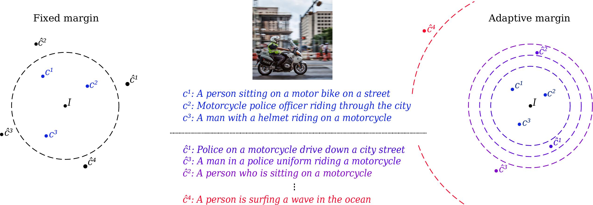

# Is An Image Worth Five Sentences? A New Look into Semantics for Image-Text Matching
Welcome! In this repo, you can find the code for [our paper](https://arxiv.org/pdf/2110.02623.pdf) published in WACV 2022. 



Main idea of this metric is to use classic image captioning metrics CIDEr or SPICE 
to better evaluate retrieval models. 

Roughly, we want to take into account the NON-GROUND TRUTH items effect in top-k retrieved items to better evaluate what our models does.

Now, this repo is divided into main section. 
The former is for the curious and while the latter is for the pragmatists! 

## To those who are curious! (How did we do it?)

First off, we had to change the code of SPICE to save all the pairwise distances.

If you would like to compile from scratch or would like to see the changes we made to SPICE, please check the 
[submodule](https://github.com/furkanbiten/SPICE/tree/a8f69f1478faea2d61d94f759ebc2ca112be3111)!

Here is the link to download the compiled version:
[SPICE.zip](https://drive.google.com/file/d/1U9M-Z44fluvIovdR4DFNd3YyyjNfL702/view?usp=sharing). 
After downloading, unzip the file and run `python get_stanford models` and then run 
```bash
java -Xmx8G -jar spice-1.0.jar ./example.json
``` 
to see if it works. 
This should result in a file called spice_pairwise.csv. 

Now, to obtain the pairwise distances of captions with CIDEr, we run:
```bash
python custom_cider.py --dataset [coco/f30k]
```

To obtain these distances we used MSCOCO and Flickr30k, [here](https://cvcuab-my.sharepoint.com/:f:/g/personal/abiten_cvc_uab_cat/EsPT2Pc8HB1PlNt-pt4s7OkBt0M68sq2UcGQR-1mLegiiw?e=oWrSUc) are they for you to download.
The reason we run these commands is to preprocess all the pairwise distances. 
So that we reduce the time it takes to run the NCS metric.

## To those who are impatient! (I just wanna use the metric and nothing more!)
You are a pragmatist and just wanna use the code (I feel you!). Download the precomputed pairwise distances
[here.](https://cvcuab-my.sharepoint.com/:f:/g/personal/abiten_cvc_uab_cat/EgwpEC4zrT1FgTVBO8Hmn00BsU6zKMyrDVSTZQUqx3avOg?e=jmlZHG)

As a format, we expect a similarity matrix saved as json where each row are images and each column are sentences. 
Distance metric choice doesn't matter, you can use anything.

Finally, just run to get the results:
```bash
python eval.py --dataset [coco/f30k] --metric_name [spice/cider] --model_path [ThePathToSimilarityMatrix]
```
There are more options to be selected, you can read them inside the code. 
